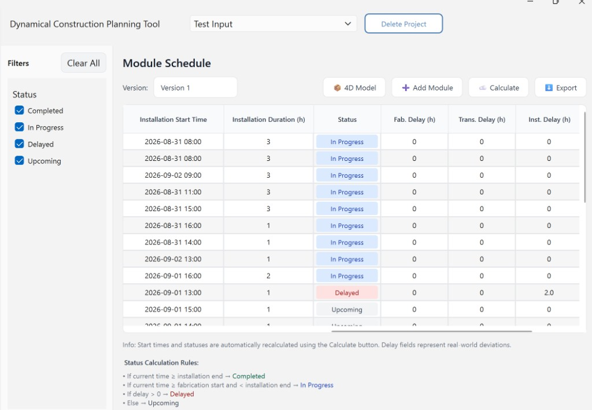
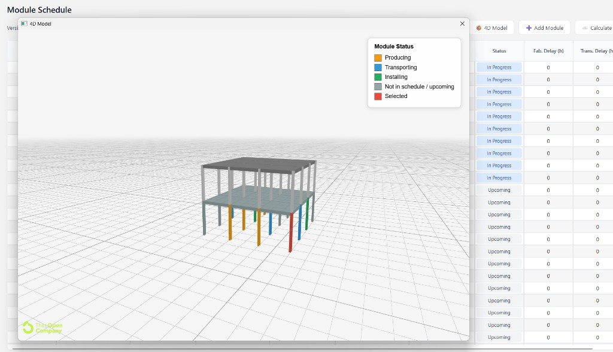
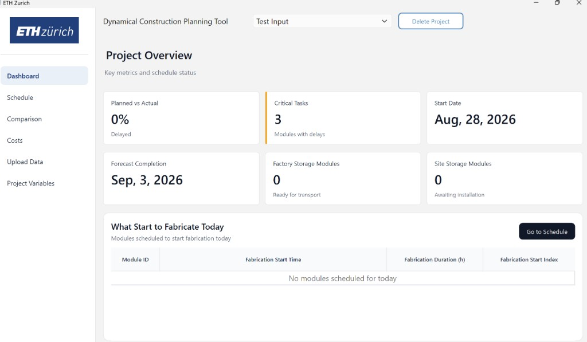
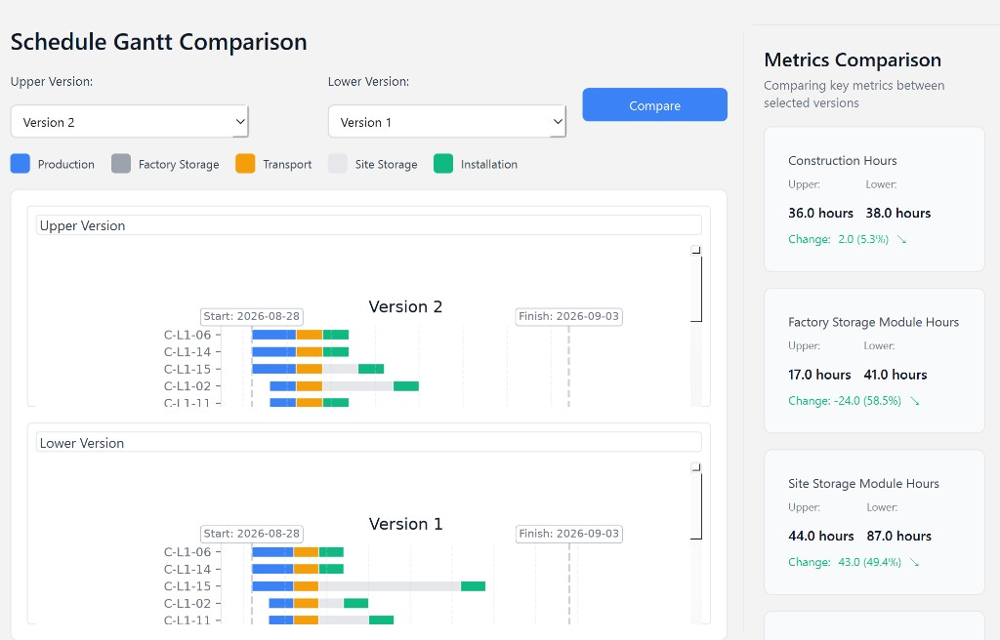
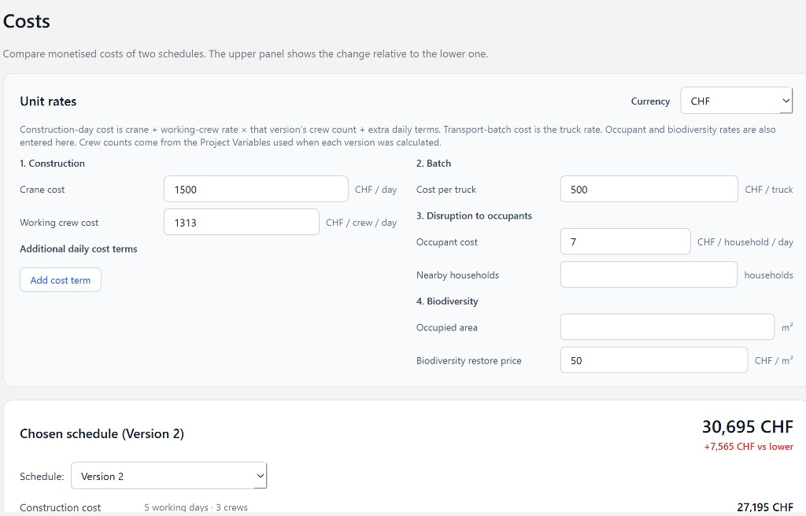

# Prefabricated Construction Scheduling Tool

**Prototype software developed by ETH Zurich for the RENOMIZE project.**

This repository is a research prototype. It is not a production product, has not been certified for operational use, and may change without notice.

The scheduler is a constraint program solved with **OR-Tools CP-SAT**. Fabrication, installation, and storage are interval variables with cumulative resource constraints; truck batching stays discrete. CP-SAT is open source (Apache 2.0); no commercial solver licence is required.

---

## Overview

The tool supports **look-ahead scheduling** of prefabricated building modules: factory fabrication, factory storage, truck transport, on-site storage, and installation. Given module durations, installation precedence, resource capacities, and a working calendar, it builds a CP-SAT model, solves it with OR-Tools, and shows the plan in a desktop UI.

The time grid is **working hours**. The monetised objective charges **working days** (hours rounded up by the length of a working day) plus **truck batches**. When delays are recorded, the tool can **re-optimize from a detection time τ**, keeping completed and in-progress work fixed.

A demonstration project is stored in `data/input_database.db`. After clone and launch, open that project on **Schedule** to inspect **Version 0**, **Version 1**, and **Version 2** (see [Demonstration versions](#demonstration-versions)).

## Features

- Import a module list from CSV and store it per project in SQLite
- Add a module later (name, three durations, installation precedence) so the next Calculate includes it
- Configure the project start date, working days, work/break hours, machines, crews, and storage capacities
- Minimize construction-day cost × working days + transport-batch cost × trucks
- Display the schedule (fabrication → factory wait → transport → site wait → installation)
- Record fabrication, transport, or installation delays and re-optimize
- Recalculate with new Project Variables
- Compare two versions (Gantt charts and operational metrics)
- Monetise two versions (construction, transport batches, occupant disruption, biodiversity)
- Export the current schedule to Excel
- Upload an IFC, convert it to ThatOpen fragments, and open a **4D Model** popup coloured by schedule status 

## Requirements

| Item | Requirement |
| --- | --- |
| Python | 3.11 or newer |
| OS | Windows, macOS, or Linux with a desktop session |
| Solver | [OR-Tools CP-SAT](https://developers.google.com/optimization) (`ortools`) |
| GUI | PyQt6, PyQt6-WebEngine (3D viewer popup) |
| Viewer | Node.js 18+ (only needed to convert a new IFC to fragments) |

Python packages:

```text
PyQt6
pandas
sqlalchemy
matplotlib
numpy
ortools
openpyxl          # Excel export
PyQt6-WebEngine   # 4D Model popup
ifcopenshell      # IFC GUID–Mark mapping
```

Confirm CP-SAT:

```bash
python -c "from ortools.sat.python import cp_model; print('ortools ok')"
```

## Installation

### 1. Clone and create a virtual environment

```bash
git clone https://github.com/earnor/look-ahead-planning.git
cd look-ahead-planning

python -m venv .venv
```

Windows (PowerShell):

```powershell
.\.venv\Scripts\Activate.ps1
```

macOS / Linux:

```bash
source .venv/bin/activate
```

### 2. Install Python dependencies

```bash
pip install PyQt6 pandas sqlalchemy matplotlib numpy openpyxl ortools PyQt6-WebEngine ifcopenshell
```

The package lives under `src/planning_tool`. Set `PYTHONPATH` to `src` (see below), or install in editable mode:

```bash
pip install -e .
```

## Running the application

From the repository root, with the virtual environment activated:

**Windows (PowerShell)**

```powershell
$env:PYTHONPATH = "src"
python src/planning_tool/main.py
```

**macOS / Linux**

```bash
PYTHONPATH=src python src/planning_tool/main.py
```

The SQLite file is `data/input_database.db`. A clone that includes this file already contains the demonstration project. If the file is missing, the application creates an empty database on first launch.

## Demonstration versions

The bundled project (typically named **Test Input**) stores three plans that are meant to be compared.

| Version | What it is |
| --- | --- |
| **Version 0** | First feasible Calculate. Baseline with **no disruptions**. |
| **Version 1** | Same Project Variables as Version 0, after **three disruptions** and a re-optimize from detection time τ. |
| **Version 2** | Built on Version 1: crew count changed to **3**, then Calculate again (no new delay). |

**Disruptions recorded for Version 1**

| Module | Phase | Change |
| --- | --- | --- |
| `C-L1-16` | Fabrication | Duration extended by **2** working hours |
| `C-L1-12` | Installation | Start postponed by **2** working hours |
| `S-L2-01` | Transport | Start postponed by **2** working hours |

On **Schedule**, pick a version in the dropdown. On **Comparison** and **Costs**, put different versions in the upper panel and the lower panel to see operational and money differences between them.

## How to use

Work through the sidebar pages in this order (or open the bundled project and skip to Schedule).

### 1. Upload Data — create a project

1. Open **Upload Data**.
2. Optionally click **Download example CSV** for a template.
3. Drop or select a CSV file (see [Input format](#input-format)).
4. Enter a project name and confirm.
5. (Optional) With that project selected, drop an IFC on **3D Building Model Upload**. The app converts it to fragments in the background (first run installs the viewer npm packages). Re-uploading an IFC for the same project **overwrites** the previous model.

The CSV table is stored as read-only. Optimization writes separate solution tables. **Add Module** on Schedule is the way to append rows for the next Calculate.

IFC colouring matches property **Mark** (on IfcBeam / IfcColumn / IfcSlab) to CSV **Module ID**.

### 2. Project Variables — calendar, resources, costs

Open **Project Variables** and save before the first **Calculate**.

| Setting | Meaning |
| --- | --- |
| Project start date | Calendar date of time index 1 (first working hour). Stored per project. Locked after the first successful Calculate. |
| Working days | Weekdays that contain working hours (default Mon–Fri) |
| Work / break times | Daily working windows; each hour is one time index |
| Machine count | Parallel factory fabrication capacity |
| Crew count | Parallel on-site installation capacity |
| Onsite / factory storage | Maximum modules that may wait at site / factory |
| Construction day cost | CHF per working day. Read-only; follows Costs: **crane + crew cost × crews + extra daily terms** (defaults: 1500 + 1313 × 2 = **4126**) |
| Transport batch cost | CHF per truck. Follows the Costs page truck cost (default **500**) |

The solver minimises

```text
construction-day cost × ⌈finish hours / hours per day⌉
+ transport-batch cost × number of trucks
```

The grid is hours; the first term bills **working days**. Storage is a hard constraint, not in the objective. The two costs are taken from the Costs page at Calculate time and stored with that version.

### 3. Schedule — optimize

1. Open **Schedule**.
2. Click **Calculate**.

The solver:

1. Builds a working-hour calendar from Project Variables.
2. Runs a constructive heuristic to size the horizon *T*.
3. Solves CP-SAT (default time limit **120 s**, relative gap **15%**).
4. Stores the first successful run as **Version 0**.

A later **Calculate** with no pending delay does **not** replace Version 0. It writes a new version with the current Project Variables (Version 2 in the demo: three crews). Activities that have already started or finished keep their start. Delay re-optimization also writes a new version (Version 1 in the demo).

If no feasible solution is found, no version is written. Check capacities, precedence, and the start date.

The table shows planned times. Row status is derived from “now” versus fabrication start and installation finish.



**Export** writes an Excel workbook of the current version (`openpyxl`).

**4D Model** opens the converted IFC in a ThatOpen popup. Modules that match the schedule are coloured by current phase (producing / transporting / installing). Double-click a coloured element to select the whole module.



### 4. Record delays and re-optimize

On **Schedule**, double-click a delay cell for **Fabrication**, **Transport**, or **Installation**.

| Delay type | Typical use |
| --- | --- |
| `DURATION_EXTENSION` | The phase takes longer than planned (demo: `C-L1-16` fabrication +2 h) |
| `START_POSTPONEMENT` | The phase cannot start at the planned time (demo: `C-L1-12` installation +2 h, `S-L2-01` transport +2 h) |

**Transport** depends on progress at detection time τ:

- Not departed → start postponement only (the truck is re-batched).
- On the road → duration extension for the **whole truck**.
- Already arrived → no transport delay.

Enter delay hours, detection time τ, and an optional reason, then **Calculate**. Completed work is frozen; in-progress work keeps leftover duration; unfixed tasks cannot start before τ. A new version is stored, linked to the base plan.

### 5. Dashboard

- **Planned vs Actual** — share of modules on the latest version whose installation finish is at or before now
- **Critical Tasks** — distinct modules with any delay record
- **Start Date**, **Forecast Completion**, and modules currently in factory or site storage



### 6. Comparison

1. Open **Comparison**.
2. Choose an **Upper** and a **Lower** version (for the demo: Version 1 or 2 vs Version 0).
3. Click **Compare**.

Each Gantt is in its own scroll area. Operational metrics:

- Construction hours
- Factory storage module hours
- Site storage module hours
- Transport batch number

Percentage change is relative to the **Lower** version. If Lower is zero, the percentage is `n/a`.



### 7. Costs

Construction and batch money use the **live** unit costs on this page together with **each version’s crew count** from its Calculate snapshot. Occupant and biodiversity costs are also entered here. Extra daily terms apply to every version’s construction-day cost.

1. Open **Costs**.
2. Occupant and biodiversity defaults are Swiss-market figures in **CHF**; replace them if needed.
3. Optionally switch the label to **EUR** (display only; no exchange-cost conversion).
4. Pick versions in the upper and lower panels. Default: latest versus **Version 0**. The upper total shows the difference versus the lower panel.

Nearby households and occupied area stay empty until you enter them; occupant and biodiversity money is then “—”.



**Default unit costs**

| Input | Default | Basis |
| --- | --- | --- |
| Crane cost | **1500** CHF/day | Daily hire of a crane with an operator (Flottek GmbH, n.d.; Rentit AG, n.d.) |
| Working crew cost | **1313** CHF/crew/day | Employer cost for a four-person crew (one foreman and three workers), including social contributions, pensions and insurance at 22.5% (Schweizerischer Baumeisterverband, 2026, p. 2) |
| Cost per truck | **500** CHF/truck | Indicative price for about a two-hour haul; replace with the actual value (Roger Rohner Transport GmbH, n.d.) |
| Occupant cost | **7** CHF/household/day | Default for monetising disruption to neighbouring households (Çelik et al., 2019) |
| Biodiversity restore price | **50** CHF/m² | Default restoration unit price for lawn, for example turf reinstatement in Switzerland (Ofri, 2026) |

At two crews the implied construction-day cost is **4126** CHF/day; at three crews it is **5439** CHF/day (1500 + 1313 × 3).

| Category | Quantity | User input | Formula |
| --- | --- | --- | --- |
| Construction | Working days (project start through latest installation finish, working calendar) | Crane, crew cost, extras × that version’s crew count | days × (crane + crew cost × crews + extras) |
| Batch | Truck trips | Cost per truck | trucks × truck cost |
| Disruption to occupants | Working days | Cost per household per day, nearby households | days × cost/household/day × households |
| Biodiversity | Occupied area (m²) | Restore price per m² | area × price |

## Input format

CSV, UTF-8, header row required.

| Column | Required | Description |
| --- | --- | --- |
| `Module ID` or `Module_ID` | yes | Unique module identifier (must match IFC **Mark** for 4D colouring) |
| `Installation Duration` | yes | Installation length in **working hours** |
| `Production Duration` | yes | Factory production length in **working hours** |
| `Transportation Duration` | yes | Transport length in **working hours** |
| `Installation Precedence` | yes | Predecessor module IDs; empty if none. Multiple: comma-separated |

Durations are non-negative whole numbers on the working-hour grid (one time index = one working hour).


## Project layout

```text
look-ahead-planning/
├── data/
│   ├── input_database.db      # SQLite (projects, schedules, versions)
│   ├── test_input.csv         # small example CSV
│   └── models/                # per-project IFC / fragments (local, not required to clone)
├── src/planning_tool/
│   ├── main.py                # application entry
│   ├── model.py               # CP-SAT scheduler
│   ├── warm_start.py          # constructive heuristic
│   ├── rescheduler.py         # delay application and re-opt constraints
│   ├── datamanager.py         # SQLite schema and project tables
│   ├── costs.py               # unit-cost defaults and monetised formulas
│   ├── ifc_model.py           # IFC storage, fragments conversion, viewer server
│   ├── ifc_guid_map.py        # IFC Mark → GUID grouping
│   └── ui/                    # PyQt6 pages, dialogs, widgets
├── viewer/                    # ThatOpen viewer and Node IFC→frag converter
├── docs/screenshots/          # README illustrations
└── tests/
```

## Solver notes

- One time period is one **working hour** on the Project Variables calendar (weekends and non-working days are skipped).
- The objective uses **working days**: ⌈finish hours / hours per day⌉, plus the number of trucks.
- Truck loads are batched (typically 3–5 modules; one partial load is allowed).
- The heuristic chooses *T* and is passed to CP-SAT as a solution hint.
- Default CP-SAT limits: **120** seconds, relative gap **0.15** (15%). Fabrication, installation, site storage, and factory storage are cumulative constraints on interval variables.
- A reported status of `OPTIMAL` can mean the gap limit was met, not that the dual bound is fully closed.

## Disclaimer

This software is a **prototype** prepared at ETH Zurich in the context of **RENOMIZE**. It is provided for research and demonstration. ETH Zurich, the authors, and project partners accept no liability for decisions made on the basis of its output.

OR-Tools is used under the [Apache License 2.0](https://www.apache.org/licenses/LICENSE-2.0). See the [OR-Tools documentation](https://developers.google.com/optimization) for details.

## Contact

Zhaoyu Wang — [zhaoyu.wang@ibi.baug.ethz.ch](mailto:zhaoyu.wang@ibi.baug.ethz.ch)
Dr. Arnor Elvarsson — [elvarsson@ibi.baug.ethz.ch](mailto:elvarsson@ibi.baug.ethz.ch)

## References

Çelik, T., Arayici, Y., & Budayan, C. (2019). Assessing the social cost of housing projects on the built environment: Analysis and monetization of the adverse impacts incurred on the neighbouring communities. *Environmental Impact Assessment Review, 77*, 1–10. https://doi.org/10.1016/j.eiar.2019.03.001

Flottek GmbH. (n.d.). *Vermietung*. https://flottek.ch/vermietung.html

Ofri. (2026, August 11). *Neuen Rasen anlegen – Kosten und Preise in der Schweiz*. https://www.ofri.ch/kosten/rasen-anlegen

Rentit AG. (n.d.). *LKW-Kran bis 37m Hubhöhe mit Bedienung*. https://www.rentit.ch/vermietung/hebetechnik/kran/detail/ak-37-150

Roger Rohner Transport GmbH. (n.d.). *Preise*. https://www.rogerrohner.ch/pricing/

Schweizerischer Baumeisterverband. (2026). *Zusatzvereinbarung Lohn LMV 2026, Anhang I: Tabellen der Mindestlöhne für 2026*. https://shop.baumeister.swiss/shop/document_download.php?document=Anhang+I+-+Lohntabelle+2026.pdf
